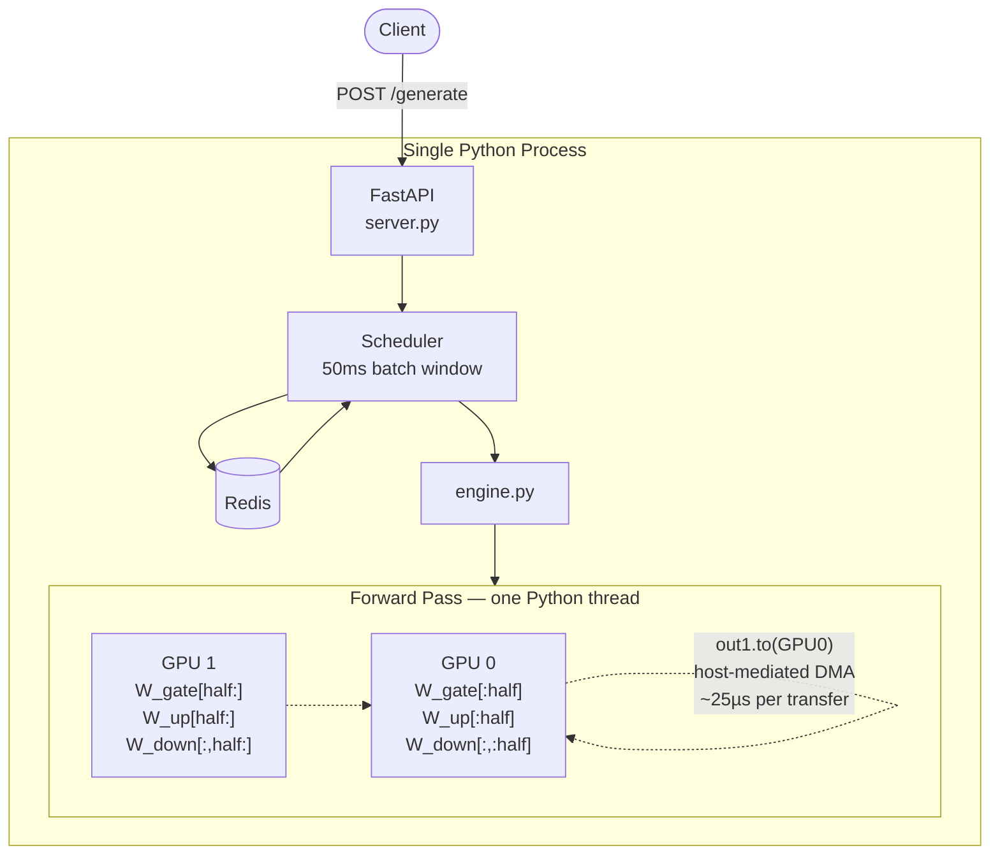
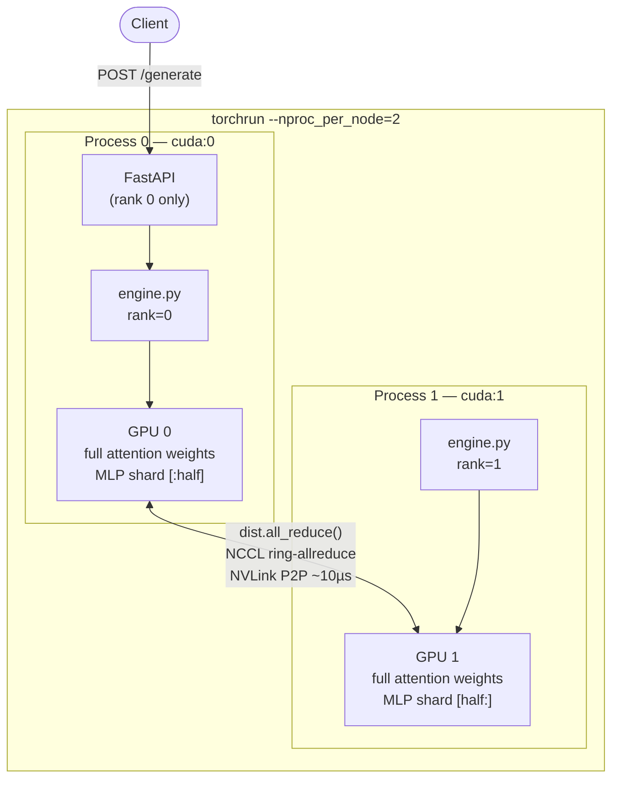

# Distributed LLM Inference Server

Two implementations of 2-GPU tensor parallelism for LLM inference, built to understand why naive approaches regress and how production systems achieve real speedup.

Model: `mistralai/Mistral-7B-Instruct-v0.3` in fp16. Hardware: 2× V100 SXM2 (32GB, NVLink 154.7 GB/s).

## Implementations

| | Single GPU | col-parallel | Megatron `.to()` | NCCL MLP-only | **Full Megatron** |
|---|---|---|---|---|---|
| **req/s** | 1.10 | 0.70 | 0.81 | 1.04 | **1.15** |
| **p99 (ms)** | 926 | 1,530 | 1,312 | 1,020 | **922** |
| **vs single GPU** | 1.0x | 0.64x | 0.74x | 0.95x | **+1.05x** |
| **MLP parallel** | — | `.to()` | `.to()` | NCCL ✓ | NCCL ✓ |
| **Attn parallel** | — | `.to()` | `.to()` | replicated ✗ | NCCL ✓ |
| **launch** | — | `python` | `python` | `torchrun` | `torchrun` |

Each step fixes exactly one thing and the result is measurable. The final jump from 0.95x → 1.05x came from parallelizing attention heads — once both MLP (65%) and attention (35%) are split, 2 GPUs finally beat 1.

**Key insight:** on NVLink hardware, the interconnect bandwidth (154 GB/s) isn't the bottleneck — *how you use it* is. `.to()` goes through the CPU driver regardless of bandwidth. NCCL ring-allreduce stays peer-to-peer in GPU SRAM. And parallelism only helps if you actually parallelize everything — leaving attention replicated kept us at 0.95x until the full split crossed 1x.

---

## Architectures

### Single-Process (`single-process/`)

One Python process owns both GPUs. Weight matrices are split manually; results are combined with `.to()` tensor copies routed through the CPU driver.



### Multi-Process NCCL (`multi-process/`)

One OS process per GPU. Each process has its own Python interpreter. Communication goes directly between GPU SRAMs via NCCL — no CPU involved.



---

## How Tensor Parallelism Works

Each transformer layer has 7 large weight matrices (Q, K, V, O projections + MLP gate/up/down). In single-GPU mode all 225 matrices sit on one card. In tensor parallel mode each matrix is split in half:

```
Single GPU                    Two GPUs (tensor parallel)
──────────                    ──────────────────────────
W (4096 × 4096)               GPU 0: W_0 (2048 × 4096)
all on cuda:0                 GPU 1: W_1 (2048 × 4096)

output = x @ W.T              out_0 = x @ W_0.T  (on GPU 0)
                              out_1 = x @ W_1.T  (on GPU 1)
                              output = cat([out_0, out_1])
```

Both GPUs load their half simultaneously — doubling effective memory bandwidth. This is why throughput improves: inference is memory-bandwidth-bound, not compute-bound.

---

## Benchmark Results

Hardware: **2× NVIDIA V100 SXM2 (32GB each, NVLink, 154.7 GB/s interconnect)** on Vast.ai

Model: `mistralai/Mistral-7B-Instruct-v0.3` in fp16 (13.5GB single GPU, 6.88GB + 6.62GB split across 2 GPUs)

### Experiment 1: Throughput

| Metric | Single GPU | col-parallel | Megatron (col/row) |
|--------|-----------|--------------|---------------------|
| Requests/sec | 1.10 | 0.70 | 0.81 |
| Tokens/sec | 149.5 | 95.2 | 110.7 |
| p99 latency (ms) | 926 | 1,530 | 1,312 |
| vs single GPU | 1.0x | 0.64x | 0.74x |

> **Finding:** Megatron (+16% over col-parallel) confirms that fewer transfers help — but both modes still regress vs single GPU. The remaining gap is the `out_1.to(GPU0)` all-reduce mechanism: even with NVLink, this is a host-mediated DMA copy that goes through the CPU driver. True NCCL peer-to-peer (in `multi-process/`) eliminates that overhead.

### Experiment 2: Concurrency Scaling

| Concurrency | Single GPU req/s | col-parallel req/s | Megatron req/s |
|------------|-----------------|-------------------|----------------|
| 1 | 0.21 | 0.14 | 0.20 |
| 2 | 0.27 | 0.19 | 0.21 |
| 4 | 0.58 | 0.37 | 0.43 |
| 8 | 1.17 | 0.74 | 0.85 |
| 16 | 2.13 | 1.40 | 1.69 |

> **Finding:** Megatron consistently ~15% faster than col-parallel at every concurrency level. Both scale linearly through batch=16 without saturating. The regression vs single GPU is consistent across all batch sizes — confirming the bottleneck is per-forward-pass communication overhead, not scheduling.

### Experiment 3: Batch Size Impact

| Batch size | Single GPU req/s | Megatron req/s | Megatron tok/s |
|-----------|-----------------|----------------|----------------|
| 1 | 0.18 | 0.12 | 23.8 |
| 2 | 0.32 | 0.19 | 38.8 |
| 4 | 0.61 | 0.39 | 78.0 |
| 8 | 1.17 | 0.85 | 170.0 |

> **Finding:** Batching is almost free on both configurations — 6-7x throughput gain from batch=1→8 with only ~20% latency increase. The Megatron vs single-GPU gap is consistent across batch sizes, ruling out scheduler overhead as the cause.

---

## Design Decisions

### Why tensor parallelism instead of pipeline parallelism?

Pipeline parallelism splits layers across GPUs (GPU 0 runs layers 1-16, GPU 1 runs layers 17-32). At low concurrency this creates idle time — GPU 1 waits for GPU 0 to finish before it can start. This "pipeline bubble" kills single-request latency.

Tensor parallelism splits each weight matrix across GPUs. Both GPUs work on every layer simultaneously. No idle time. The tradeoff is communication overhead — an all-reduce after every layer. Even on V100 NVLink (154.7 GB/s), naive column-parallel shows a regression (0.64x) because 450 transfers per forward pass is too many synchronization points regardless of bandwidth.

This is why production systems use Megatron-style alternating col/row parallelism — reducing MLP transfers from 6 to 2 per block brings total transfers from 450 to ~224. Implemented in `parallel_megatron.py`.

### Why Redis for the queue instead of an in-memory queue?

An in-memory asyncio queue would be simpler, but Redis gives us:
- **Durability** — requests survive server crashes
- **Observability** — you can inspect queue depth with `redis-cli llen inference:queue`
- **Scalability** — multiple server processes can share one queue

For a production inference server the Redis overhead is negligible compared to GPU time.

### Two tensor parallelism strategies — naive column-parallel vs Megatron

This project implements both approaches so the communication overhead is measurable, not just theoretical.

**Method 1: Naive column-parallel** (`src/parallel.py`)

Every Linear layer is treated the same: split output features across GPUs, gather results back.

```
For each Linear(in, out):
  GPU0: x → W0(out//2, in) → partial_0    (1 transfer in)
  GPU1: x → W1(out//2, in) → partial_1    (1 transfer in)
  output = cat([partial_0, partial_1])      (1 transfer out)
```

Cost: 2 transfers × 225 layers = **450 cross-GPU transfers per forward pass**.

**Method 2: Megatron-style alternating col/row** (`src/parallel_megatron.py`)

Reference: Shoeybi et al., *Megatron-LM: Training Multi-Billion Parameter Language Models Using Model Parallelism* (2019). [arXiv:1909.08053](https://arxiv.org/abs/1909.08053)

The key insight from the paper: a column-parallel layer produces output **already split** across GPUs. A row-parallel layer expects input **already split** across GPUs. Back-to-back col→row layers need **zero communication** in the middle — only one all-reduce at the end of the pair.

Applied to the MLP block (gate/up/down projections):
```
gate_proj, up_proj: column-parallel  → output stays split across GPUs (NO gather)
down_proj:          row-parallel     → takes the split input, sums via all-reduce

GPU0: gate_0 = x @ G0.T  ||  GPU1: gate_1 = x @ G1.T   [no transfer between]
GPU0: up_0   = x @ U0.T  ||  GPU1: up_1   = x @ U1.T   [no transfer between]
GPU0: h_0 = act(gate_0)*up_0  ||  GPU1: h_1 = act(gate_1)*up_1  [no comm]
GPU0: out_0 = h_0 @ D0.T  ||  GPU1: out_1 = h_1 @ D1.T   [row parallel]
output = out_0 + out_1.to(GPU0)   [all-reduce — only 1 transfer out]
```

Cost per MLP block: **2 transfers** (copy x in, sum out) vs 6 in naive approach.

Total: ~64 MLP transfers + ~160 attention transfers = **~224 transfers per forward pass** — roughly 2× fewer syncs than naive.

The benchmarks quantify this gap. On NVLink (154.7 GB/s) the savings are real; on PCIe (12.3 GB/s) even the cheaper Megatron approach struggles because the interconnect itself is the bottleneck.

### Why fp16 instead of int8/int4 quantization?

fp16 halves memory vs fp32 with essentially no quality loss — it's a free lunch for inference. Quantization (int8/int4) goes further but introduces approximation error and requires calibration data. For a system focused on measuring parallelism, fp16 keeps the baseline clean.

---

## How to Reproduce on Vast.ai

### 1. Rent an instance

On [vast.ai](https://vast.ai), filter for:
- **GPU:** 2× A10G (or 2× RTX 3090 as a cheaper alternative)
- **Image:** `pytorch/pytorch:2.2.0-cuda12.1-cudnn8-runtime`
- **Disk:** 50GB+ (model weights + Docker images)

### 2. SSH in and clone the repo

```bash
git clone <your-repo-url>
cd distributed-inference
```

### 3. Set your HuggingFace token

```bash
export HF_TOKEN=hf_your_token_here
```

You need to accept Llama's license at huggingface.co/meta-llama first.

### 4. Run benchmarks (no Docker needed)

```bash
pip install -r requirements.txt

# Single GPU baseline
python benchmarks/single_gpu.py

# Multi GPU with tensor parallelism
python benchmarks/multi_gpu.py

# Compare and print summary
python benchmarks/run_benchmarks.py --skip-single --skip-multi
```

Results are saved to `benchmarks/results/`.

### 5. Run the full server stack

```bash
# Spin up API + Redis + Prometheus + Grafana
docker compose up --build

# In another terminal, test it
curl -X POST http://localhost:8000/generate \
  -H "Content-Type: application/json" \
  -d '{"prompt": "Explain attention in transformers", "max_tokens": 100}'

# Check metrics
curl http://localhost:8000/metrics

# Grafana dashboard
open http://localhost:3000   # admin / admin
```

### 6. Switch to 2-GPU mode

```bash
NUM_GPUS=2 docker compose up --build
```

---

## Environment Variables

| Variable | Default | Description |
|----------|---------|-------------|
| `HF_TOKEN` | required | HuggingFace access token |
| `MODEL_NAME` | `meta-llama/Llama-3.2-3B-Instruct` | Model to load |
| `NUM_GPUS` | `1` | Number of GPUs (1 or 2) |
| `BATCH_WINDOW_MS` | `50` | Max time to wait before firing a batch |
| `MAX_BATCH_SIZE` | `8` | Max requests per batch |
| `REDIS_URL` | `redis://localhost:6379` | Redis connection URL |

---

## Project Structure

```
distributed-inference/
├── src/
│   ├── server.py              FastAPI app, routes, lifespan
│   ├── engine.py              Model loading, generate() — parallelism_mode param
│   ├── parallel.py            Naive column-parallel (450 transfers/pass)
│   ├── parallel_megatron.py   Megatron-style col/row alternation (~224 transfers/pass)
│   ├── scheduler.py           Redis queue, batch window, Future resolution
│   └── metrics.py             Prometheus counters, histograms, gauges
├── benchmarks/
│   ├── single_gpu.py          Single GPU experiments
│   ├── multi_gpu.py           2-GPU experiments — runs both parallelism modes
│   ├── run_benchmarks.py      Runs all, computes speedup, prints summary
│   └── results/               JSON output files (one per mode)
├── dashboard/
│   └── grafana_config.json
├── Dockerfile
├── docker-compose.yml
├── prometheus.yml
└── requirements.txt
```
