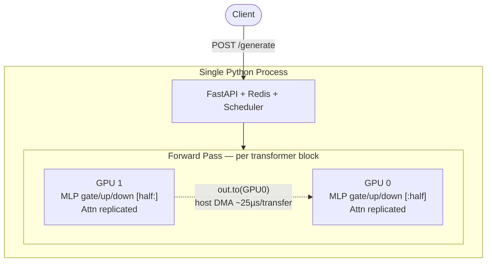
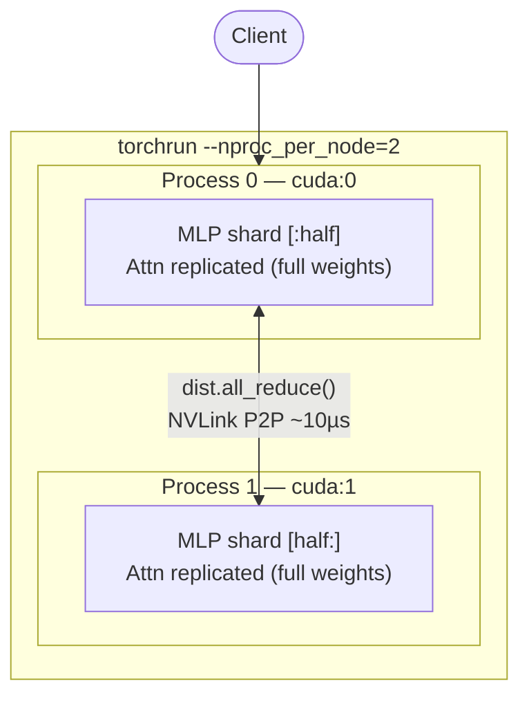
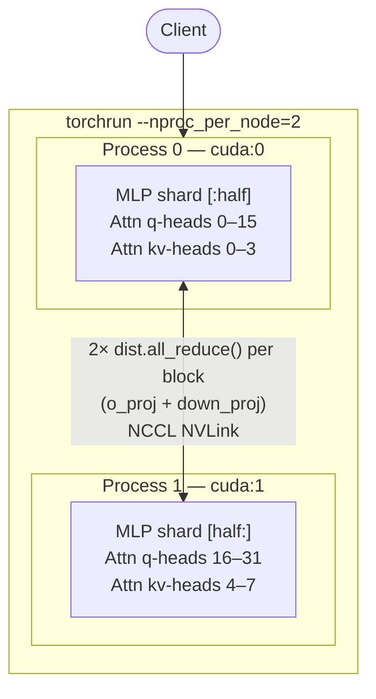

# Distributed LLM Inference Server

Built four implementations of 2-GPU tensor parallelism from scratch, each fixing one flaw in the previous — going from a 0.64x regression to a 1.05x speedup over single GPU.

**Model:** `mistralai/Mistral-7B-Instruct-v0.3` in fp16  
**Hardware:** 2× V100 SXM2 (32GB each, NVLink 154.7 GB/s) on Vast.ai  
**Reference:** Shoeybi et al., *Megatron-LM* (2019). [arXiv:1909.08053](https://arxiv.org/abs/1909.08053)

---

## Results

| | Single GPU | col-parallel | Megatron `.to()` | NCCL MLP-only | **Full Megatron** |
|---|---|---|---|---|---|
| **req/s** | 1.10 | 0.70 | 0.81 | 1.04 | **1.15** |
| **p99 (ms)** | 926 | 1,530 | 1,312 | 1,020 | **922** |
| **vs single GPU** | 1.0x | 0.64x | 0.74x | 0.95x | **+1.05x** |
| **MLP parallel** | — | `.to()` | `.to()` | NCCL ✓ | NCCL ✓ |
| **Attn parallel** | — | `.to()` | `.to()` | replicated ✗ | NCCL ✓ |
| **launch** | — | `python` | `python` | `torchrun` | `torchrun` |

---

## The Progression

### Step 1 — Naive column-parallel: 0.64x

Split every Linear weight matrix in half. GPU 0 and GPU 1 each compute half the output features, then one GPU waits for the other's result via `.to()`. Simple to implement — but 450 cross-GPU transfers per forward pass (2 per layer × 225 layers). Even on NVLink, the result is a regression.

### Step 2 — Megatron alternating col/row: 0.74x

The key insight from the Megatron paper: a column-parallel layer produces output *already split* across GPUs, and a row-parallel layer expects input *already split*. Chain them back-to-back and you get zero communication in the middle — only one all-reduce at the end of the pair. Applied to the MLP block (gate/up/down), this cuts MLP transfers from 6 → 2 per block. Total drops from 450 → ~224. Result: +16% over naive, but still regressing vs single GPU.

The bottleneck isn't the transfer count — it's `.to()` itself. Even one transfer per layer is slow because `.to()` is host-mediated: the data moves GPU → CPU driver → GPU, regardless of how fast NVLink is. The driver overhead dominates.

### Step 3 — NCCL multi-process, MLP only: 0.95x

Switch from one Python process to one process per GPU (`torchrun`). Now communication uses `dist.all_reduce()` — NCCL's ring-allreduce, which moves data directly between GPU SRAMs over NVLink without touching the CPU. Same Megatron alternating col/row strategy, but the all-reduce is ~2.5x faster per call.

MLP is now effectively parallelized. But attention (~35% of compute) is still fully replicated — both GPUs run the same attention computation. Hence 0.95x, not >1x.

### Step 4 — Full Megatron, MLP + attention: 1.05x ✓

Patch the attention module directly: split query heads (16 per GPU), KV heads (4 per GPU), and use NCCL all_reduce on `o_proj`. Mistral 7B uses GQA with a 4:1 ratio (32q:8kv) — this ratio is preserved per rank (16q:4kv), so the grouped attention math works identically on each GPU's subset. Now both the 65% (MLP) and 35% (attention) are actually parallel, and 2 GPUs finally beat 1.

---

## Architectures

### Single-Process (`single-process/`)

One Python process owns both GPUs. `.to()` copies route through the CPU driver.



### Multi-Process NCCL (`multi-process/`)

One OS process per GPU. NCCL ring-allreduce bypasses the CPU entirely. MLP is parallel; attention is still replicated.



### Full Megatron (`full-megatron/`)

Both MLP and attention heads split. Each GPU handles a different subset of heads; one NCCL all_reduce per block combines the results. This is what vLLM and TGI run in production.



---

## Concurrency Scaling

Tensor parallelism is a batching optimization — communication overhead is fixed per forward pass, so it gets amortized as batch size grows.

| Concurrency | Single GPU req/s | Full Megatron req/s |
|------------|-----------------|---------------------|
| 1 | 0.21 | 0.15 |
| 2 | 0.27 | 0.28 |
| 4 | 0.58 | 0.56 |
| 8 | 1.17 | 1.11 |
| 16 | 2.13 | **2.21** |

At concurrency=1 (one request at a time), Full Megatron is slower — NCCL setup overhead dominates a single short request. By concurrency=2 they're even. By concurrency=16, Full Megatron pulls ahead. This is the same reason production systems like vLLM use continuous batching — keeping the GPU saturated is what makes tensor parallelism worth the complexity.

---

## How to Run

Requires 2 GPUs with NVLink. Tested on V100 SXM2 via Vast.ai.

```bash
git clone https://github.com/sahilnale/distributed-llm-inference-server
cd distributed-llm-inference-server
export HF_TOKEN=your_token_here

# 1. Single GPU baseline
python single-process/benchmarks/single_gpu.py

# 2. Single-process tensor parallelism
python single-process/benchmarks/multi_gpu.py --mode column   # naive
python single-process/benchmarks/multi_gpu.py --mode megatron # alternating col/row

# 3. NCCL multi-process (MLP only)
torchrun --nproc_per_node=2 multi-process/benchmarks/benchmark.py

# 4. Full Megatron (MLP + attention heads)
torchrun --nproc_per_node=2 full-megatron/benchmarks/benchmark.py
```

---

## Project Structure

```
distributed-llm-inference-server/
├── single-process/        One Python process — col-parallel and Megatron col/row
│   ├── src/
│   │   ├── engine.py              Model loading, parallelism_mode param
│   │   ├── parallel.py            Naive column-parallel (450 transfers/pass)
│   │   ├── parallel_megatron.py   Megatron col/row (~224 transfers/pass)
│   │   ├── server.py              FastAPI with Redis queue + Prometheus metrics
│   │   └── scheduler.py           Batch window (50ms or max 8 requests)
│   └── benchmarks/
│       ├── single_gpu.py          Single GPU experiments
│       ├── multi_gpu.py           2-GPU experiments (--mode column|megatron)
│       └── run_benchmarks.py      Loads saved JSONs, prints comparison
├── multi-process/         One process per GPU — NCCL, MLP parallel only
│   ├── src/
│   │   ├── parallel_dist.py       MegatronMLPDist with dist.all_reduce()
│   │   └── engine.py              Rank-aware loading + input broadcast
│   └── benchmarks/benchmark.py
└── full-megatron/         One process per GPU — NCCL, MLP + attention heads
    ├── src/
    │   ├── parallel_full.py       MegatronMLPFull + TensorParallelAttention
    │   └── engine.py
    └── benchmarks/benchmark.py
```
