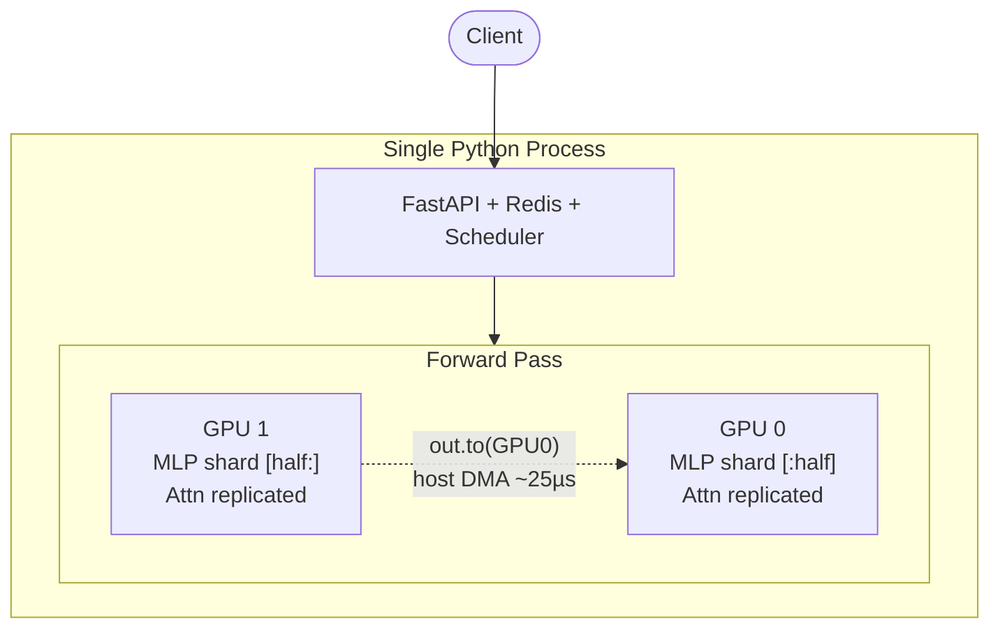
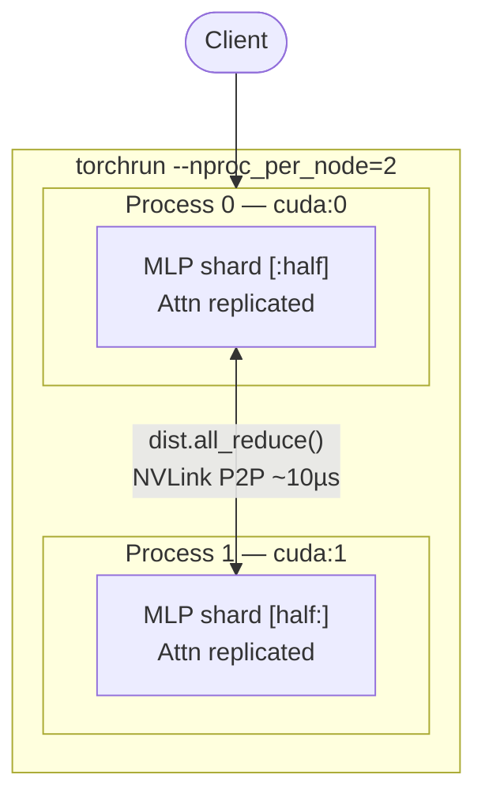
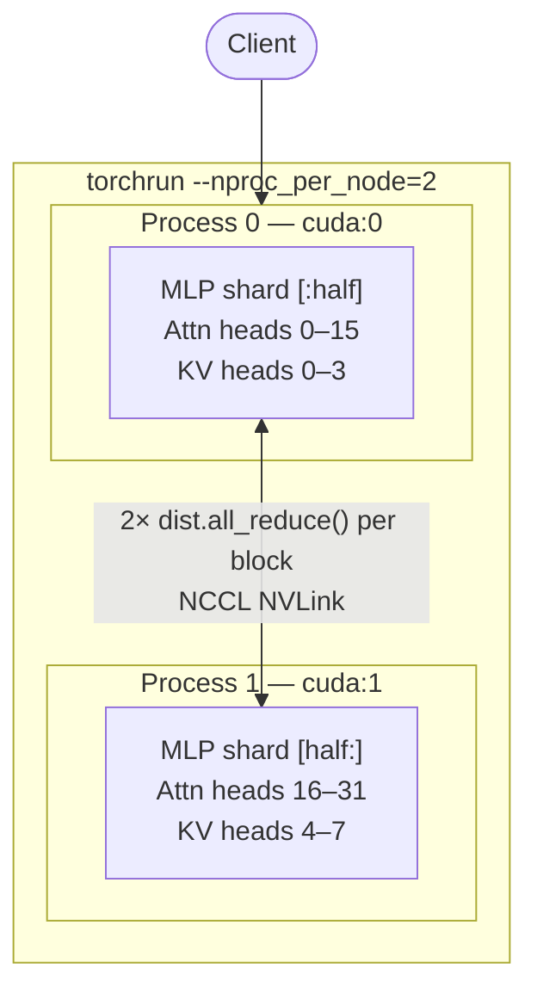

# Distributed LLM Inference Server

Three implementations of 2-GPU tensor parallelism for LLM inference, built from scratch to understand why naive approaches regress and how production systems achieve real speedup.

**Model:** `mistralai/Mistral-7B-Instruct-v0.3` in fp16  
**Hardware:** 2× V100 SXM2 (32GB each, NVLink 154.7 GB/s) on Vast.ai

---

## Results

| | Single GPU | col-parallel | Megatron `.to()` | NCCL MLP-only | **Full Megatron** |
|---|---|---|---|---|---|
| **req/s** | 1.10 | 0.70 | 0.81 | 1.04 | **1.15** |
| **p99 (ms)** | 926 | 1,530 | 1,312 | 1,020 | **922** |
| **vs single GPU** | 1.0x | 0.64x | 0.74x | 0.95x | **+1.05x** |
| **MLP parallel** | — | `.to()` | `.to()` | NCCL ✓ | NCCL ✓ |
| **Attn parallel** | — | `.to()` | `.to()` | replicated ✗ | NCCL ✓ |
| **launch** | — | `python` | `python` | `torchrun` | `torchrun` |

Each step fixes exactly one thing. The jump from 0.95x → 1.05x came from parallelizing attention — once both MLP (65% of compute) and attention (35%) are split across GPUs, 2 GPUs finally beat 1.

**Key insight:** NVLink bandwidth (154 GB/s) isn't the bottleneck — `.to()` routes through the CPU driver regardless of hardware. NCCL ring-allreduce stays peer-to-peer in GPU SRAM. And you have to parallelize everything — leaving attention replicated kept us at 0.95x until the full split crossed 1x.

---

## Architectures

### Single-Process (`single-process/`)

One Python process, two GPUs. Communication via `.to()` — host-mediated DMA through the CPU driver.



### Multi-Process NCCL (`multi-process/`)

One process per GPU. NCCL ring-allreduce stays in GPU SRAM — no CPU involved. MLP split, attention still replicated.



### Full Megatron (`full-megatron/`)

Both MLP and attention heads split across GPUs. This is what vLLM and TGI run in production.



---

## How to Run

```bash
git clone https://github.com/sahilnale/distributed-llm-inference-server
cd distributed-llm-inference-server
export HF_TOKEN=your_token_here

# Single GPU baseline
python single-process/benchmarks/single_gpu.py

# Single-process tensor parallelism (col-parallel or Megatron)
python single-process/benchmarks/multi_gpu.py --mode megatron

# NCCL multi-process (MLP only)
torchrun --nproc_per_node=2 multi-process/benchmarks/benchmark.py

# Full Megatron (MLP + attention heads)
torchrun --nproc_per_node=2 full-megatron/benchmarks/benchmark.py
```

---

## Project Structure

```
distributed-llm-inference-server/
├── single-process/        Single Python process — naive col-parallel + Megatron col/row
│   ├── src/               engine.py, parallel.py, parallel_megatron.py, server, scheduler
│   └── benchmarks/
├── multi-process/         One process per GPU — NCCL all_reduce, MLP parallel only
│   ├── src/               parallel_dist.py, engine.py
│   └── benchmarks/
└── full-megatron/         One process per GPU — NCCL, MLP + attention head parallel
    ├── src/               parallel_full.py, engine.py
    └── benchmarks/
```
