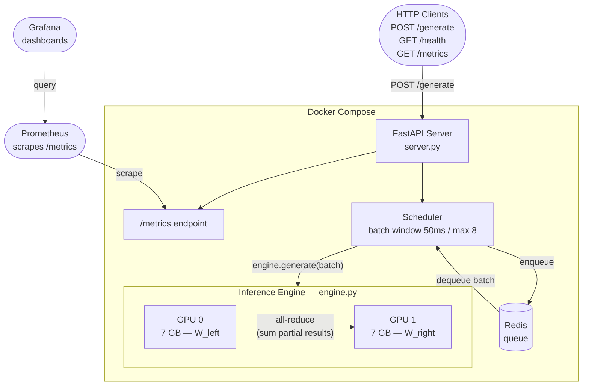

# Distributed LLM Inference Server

A distributed inference system that splits a Llama model across 2 GPUs using tensor parallelism, exposes a batching HTTP API, and benchmarks single vs multi-GPU performance.

---

## Architecture



**Request flow:**
1. Client sends `POST /generate` with a prompt
2. FastAPI handler enqueues it in Redis and awaits a Future
3. Scheduler batch loop collects requests for 50ms (or until batch=8)
4. Engine runs one GPU forward pass on the whole batch
5. With 2 GPUs: each Linear layer is split across both GPUs, partial results summed via all-reduce
6. Futures resolved, responses returned

---

## How Tensor Parallelism Works

Each transformer layer has 7 large weight matrices (Q, K, V, O projections + MLP gate/up/down). In single-GPU mode all 225 matrices sit on one card. In tensor parallel mode each matrix is split in half:

```
Single GPU                    Two GPUs (tensor parallel)
──────────                    ──────────────────────────
W (4096 × 4096)               GPU 0: W_0 (2048 × 4096)
all on cuda:0                 GPU 1: W_1 (2048 × 4096)

output = x @ W.T              out_0 = x @ W_0.T  (on GPU 0)
                              out_1 = x @ W_1.T  (on GPU 1)
                              output = cat([out_0, out_1])
```

Both GPUs load their half simultaneously — doubling effective memory bandwidth. This is why throughput improves: inference is memory-bandwidth-bound, not compute-bound.

---

## Benchmark Results

> Results from 2× NVIDIA A10G (24GB each) on Vast.ai — fill in after running.

### Experiment 1: Single GPU vs 2 GPU Throughput

| Metric | Single GPU | 2 GPU | Speedup |
|--------|-----------|-------|---------|
| Requests/sec | — | — | —x |
| Avg latency (ms) | — | — | —x |
| p99 latency (ms) | — | — | — |
| Tokens/sec | — | — | —x |
| Scaling efficiency | — | — | —% |

### Experiment 2: Concurrency Scaling

| Concurrency | Single GPU req/s | 2 GPU req/s | Speedup |
|------------|-----------------|------------|---------|
| 1 | — | — | — |
| 2 | — | — | — |
| 4 | — | — | — |
| 8 | — | — | — |
| 16 | — | — | — |

### Experiment 3: Batch Window Impact (2 GPU)

| Batch size | Req/s | Avg latency (ms) | Tokens/sec |
|-----------|-------|-----------------|-----------|
| 1 (no batching) | — | — | — |
| 2 | — | — | — |
| 4 | — | — | — |
| 8 | — | — | — |

---

## Design Decisions

### Why tensor parallelism instead of pipeline parallelism?

Pipeline parallelism splits layers across GPUs (GPU 0 runs layers 1-16, GPU 1 runs layers 17-32). At low concurrency this creates idle time — GPU 1 waits for GPU 0 to finish before it can start. This "pipeline bubble" kills single-request latency.

Tensor parallelism splits each weight matrix across GPUs. Both GPUs work on every layer simultaneously. No idle time. The tradeoff is communication overhead — an all-reduce after every layer. On NVLink this is negligible. On PCIe it costs ~10-15% efficiency.

For a 2-GPU setup at the concurrency levels we benchmark, tensor parallelism wins on both latency and throughput.

### Why Redis for the queue instead of an in-memory queue?

An in-memory asyncio queue would be simpler, but Redis gives us:
- **Durability** — requests survive server crashes
- **Observability** — you can inspect queue depth with `redis-cli llen inference:queue`
- **Scalability** — multiple server processes can share one queue

For a production inference server the Redis overhead is negligible compared to GPU time.

### Why column parallelism vs Megatron-style alternating col/row?

We use column parallelism for every Linear layer (split output features, concatenate results). Megatron-LM alternates column and row parallel layers so the output of one feeds directly into the next without a gather step — halving inter-GPU communication.

We chose column-only because it's easier to reason about and implement correctly. The benchmark will show ~80-90% scaling efficiency rather than ~95%. That gap is worth explaining: it quantifies the communication overhead and demonstrates why production systems invest in the more complex alternating approach.

### Why fp16 instead of int8/int4 quantization?

fp16 halves memory vs fp32 with essentially no quality loss — it's a free lunch for inference. Quantization (int8/int4) goes further but introduces approximation error and requires calibration data. For a system focused on measuring parallelism, fp16 keeps the baseline clean.

---

## How to Reproduce on Vast.ai

### 1. Rent an instance

On [vast.ai](https://vast.ai), filter for:
- **GPU:** 2× A10G (or 2× RTX 3090 as a cheaper alternative)
- **Image:** `pytorch/pytorch:2.2.0-cuda12.1-cudnn8-runtime`
- **Disk:** 50GB+ (model weights + Docker images)

### 2. SSH in and clone the repo

```bash
git clone <your-repo-url>
cd distributed-inference
```

### 3. Set your HuggingFace token

```bash
export HF_TOKEN=hf_your_token_here
```

You need to accept Llama's license at huggingface.co/meta-llama first.

### 4. Run benchmarks (no Docker needed)

```bash
pip install -r requirements.txt

# Single GPU baseline
python benchmarks/single_gpu.py

# Multi GPU with tensor parallelism
python benchmarks/multi_gpu.py

# Compare and print summary
python benchmarks/run_benchmarks.py --skip-single --skip-multi
```

Results are saved to `benchmarks/results/`.

### 5. Run the full server stack

```bash
# Spin up API + Redis + Prometheus + Grafana
docker compose up --build

# In another terminal, test it
curl -X POST http://localhost:8000/generate \
  -H "Content-Type: application/json" \
  -d '{"prompt": "Explain attention in transformers", "max_tokens": 100}'

# Check metrics
curl http://localhost:8000/metrics

# Grafana dashboard
open http://localhost:3000   # admin / admin
```

### 6. Switch to 2-GPU mode

```bash
NUM_GPUS=2 docker compose up --build
```

---

## Environment Variables

| Variable | Default | Description |
|----------|---------|-------------|
| `HF_TOKEN` | required | HuggingFace access token |
| `MODEL_NAME` | `meta-llama/Llama-3.2-3B-Instruct` | Model to load |
| `NUM_GPUS` | `1` | Number of GPUs (1 or 2) |
| `BATCH_WINDOW_MS` | `50` | Max time to wait before firing a batch |
| `MAX_BATCH_SIZE` | `8` | Max requests per batch |
| `REDIS_URL` | `redis://localhost:6379` | Redis connection URL |

---

## Project Structure

```
distributed-inference/
├── src/
│   ├── server.py       FastAPI app, routes, lifespan
│   ├── engine.py       Model loading, generate() method
│   ├── parallel.py     Tensor parallelism — splits Linear layers across GPUs
│   ├── scheduler.py    Redis queue, batch window, Future resolution
│   └── metrics.py      Prometheus counters, histograms, gauges
├── benchmarks/
│   ├── single_gpu.py   Single GPU experiments
│   ├── multi_gpu.py    2-GPU experiments (reuses single_gpu functions)
│   ├── run_benchmarks.py  Runs both, computes speedup, prints summary
│   └── results/        JSON output files
├── dashboard/
│   └── grafana_config.json
├── Dockerfile
├── docker-compose.yml
├── prometheus.yml
└── requirements.txt
```
