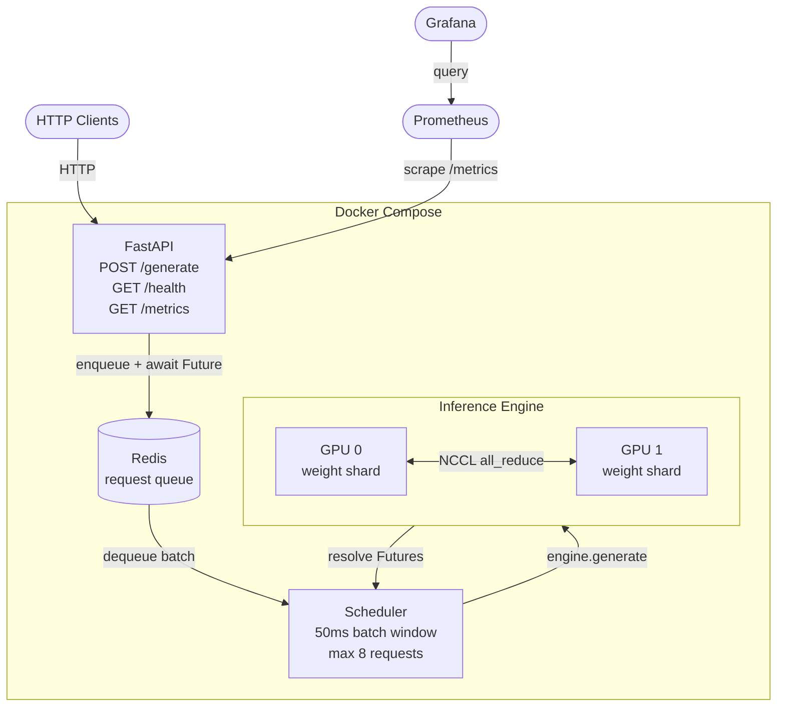

# Distributed LLM Inference Server

A production-grade LLM inference server with a batching HTTP API, Redis request queue, Prometheus metrics, and Grafana dashboards — built on top of four progressively better GPU parallelism strategies, going from a 0.64x regression to a 1.05x speedup over single GPU.

**Model:** `mistralai/Mistral-7B-Instruct-v0.3` in fp16  
**Hardware:** 2× V100 SXM2 (32GB each, NVLink 154.7 GB/s) on Vast.ai  
**Reference:** Shoeybi et al., *Megatron-LM* (2019). [arXiv:1909.08053](https://arxiv.org/abs/1909.08053)

---

## System Architecture



**Request lifecycle:**
1. Client POSTs to `/generate` — FastAPI enqueues it in Redis and returns a `Future`
2. Scheduler collects requests for 50ms (or until batch=8), then fires a batch
3. Engine tokenizes, runs a GPU forward pass across both GPUs in parallel, decodes
4. Futures resolve — all clients in the batch get their responses simultaneously
5. Prometheus scrapes `/metrics` every 15s — latency histograms, token throughput, queue depth, GPU memory

---

## Stack

| Layer | Technology | Detail |
|-------|-----------|--------|
| API | FastAPI | Async HTTP, Pydantic validation, lifespan model loading |
| Queue | Redis | Durable request queue, inspectable with `redis-cli` |
| Batching | asyncio + ThreadPoolExecutor | 50ms window, max batch=8, GIL-released GPU calls |
| Metrics | Prometheus + Grafana | p50/p99 latency, tok/s, queue depth, GPU memory |
| Inference | PyTorch fp16 | HuggingFace Transformers, custom tensor parallelism |
| GPU comm | NCCL / torchrun | Ring-allreduce, NVLink peer-to-peer |
| Deploy | Docker Compose | API + Redis + Prometheus + Grafana, one command |

---

## GPU Parallelism Results

Four implementations, each fixing one flaw in the previous:

| | Single GPU | col-parallel | Megatron `.to()` | NCCL MLP-only | **Full Megatron** |
|---|---|---|---|---|---|
| **req/s** | 1.10 | 0.70 | 0.81 | 1.04 | **1.15** |
| **p99 (ms)** | 926 | 1,530 | 1,312 | 1,020 | **922** |
| **vs single GPU** | 1.0x | 0.64x | 0.74x | 0.95x | **+1.05x** |
| **MLP parallel** | — | `.to()` | `.to()` | NCCL ✓ | NCCL ✓ |
| **Attn parallel** | — | `.to()` | `.to()` | replicated ✗ | NCCL ✓ |
| **launch** | — | `python` | `python` | `torchrun` | `torchrun` |

### The Progression

**Step 1 — Naive column-parallel: 0.64x**  
Split every Linear weight in half, combine results with `.to()`. Simple, but 450 cross-GPU transfers per forward pass and every one goes through the CPU driver. Regression on both PCIe and NVLink hardware.

**Step 2 — Megatron alternating col/row: 0.74x**  
Chain column-parallel → row-parallel so intermediate results never need to be gathered — only one all-reduce at the end of each MLP block. Cuts transfers from 450 → ~224. Still regressing because `.to()` itself is the bottleneck, not the transfer count.

**Step 3 — NCCL multi-process, MLP only: 0.95x**  
One OS process per GPU (`torchrun`), `dist.all_reduce()` instead of `.to()`. NCCL ring-allreduce stays peer-to-peer in GPU SRAM — no CPU involved, ~2.5x faster per call. MLP fully parallelized. Attention still replicated (both GPUs run the same computation), hence 0.95x not >1x.

**Step 4 — Full Megatron, MLP + attention: 1.05x ✓**  
Patch the attention module to split query heads (16/GPU) and KV heads (4/GPU). Mistral's GQA ratio (32q:8kv = 4:1) is preserved per rank, so attention math works identically on each GPU's subset. Now both MLP (65%) and attention (35%) are actually split — 2 GPUs finally beat 1.

---

## Concurrency Scaling

Tensor parallelism is a batching optimization — fixed communication overhead gets amortized as batch size grows.

| Concurrency | Single GPU req/s | Full Megatron req/s |
|------------|-----------------|---------------------|
| 1 | 0.21 | 0.15 |
| 2 | 0.27 | 0.28 |
| 4 | 0.58 | 0.56 |
| 8 | 1.17 | 1.11 |
| 16 | 2.13 | **2.21** |

At concurrency=1, Full Megatron is slower (NCCL setup overhead on a single request). By concurrency=2 they're even. At concurrency=16, Full Megatron pulls ahead. This is exactly why production systems use continuous batching — keeping the GPU saturated amortizes the communication cost.

---

## Running the Server

```bash
git clone https://github.com/sahilnale/distributed-llm-inference-server
cd distributed-llm-inference-server

# Spin up the full stack (API + Redis + Prometheus + Grafana)
cd single-process
HF_TOKEN=your_token docker compose up --build

# Send a request
curl -X POST http://localhost:8000/generate \
  -H "Content-Type: application/json" \
  -d '{"prompt": "Explain attention in transformers", "max_tokens": 100}'

# View metrics
curl http://localhost:8000/metrics

# Grafana dashboard
open http://localhost:3000   # admin / admin
```

Switch to 2-GPU tensor parallel mode:
```bash
NUM_GPUS=2 docker compose up --build
```

## Running Benchmarks

```bash
export HF_TOKEN=your_token_here

# Single GPU baseline
python single-process/benchmarks/single_gpu.py

# Single-process tensor parallelism
python single-process/benchmarks/multi_gpu.py --mode column
python single-process/benchmarks/multi_gpu.py --mode megatron

# NCCL multi-process (MLP only)
torchrun --nproc_per_node=2 multi-process/benchmarks/benchmark.py

# Full Megatron (MLP + attention heads)
torchrun --nproc_per_node=2 full-megatron/benchmarks/benchmark.py
```

---

## Project Structure

```
distributed-llm-inference-server/
├── single-process/        Single Python process — full server stack + two parallelism modes
│   ├── src/
│   │   ├── server.py              FastAPI app, routes, lifespan model loading
│   │   ├── engine.py              Model loading, generate(), parallelism_mode param
│   │   ├── scheduler.py           Redis queue, 50ms batch window, asyncio Futures
│   │   ├── metrics.py             Prometheus counters, histograms, gauges
│   │   ├── parallel.py            Naive column-parallel (450 transfers/pass)
│   │   └── parallel_megatron.py   Megatron col/row (~224 transfers/pass)
│   ├── benchmarks/
│   ├── dashboard/grafana_config.json
│   ├── docker-compose.yml
│   ├── prometheus.yml
│   └── Dockerfile
├── multi-process/         One process per GPU — NCCL, MLP parallel only
│   ├── src/
│   │   ├── parallel_dist.py       MegatronMLPDist with dist.all_reduce()
│   │   └── engine.py              Rank-aware loading, input broadcast via NCCL
│   └── benchmarks/benchmark.py
└── full-megatron/         One process per GPU — NCCL, MLP + attention heads
    ├── src/
    │   ├── parallel_full.py       MegatronMLPFull + TensorParallelAttention
    │   └── engine.py
    └── benchmarks/benchmark.py
```
